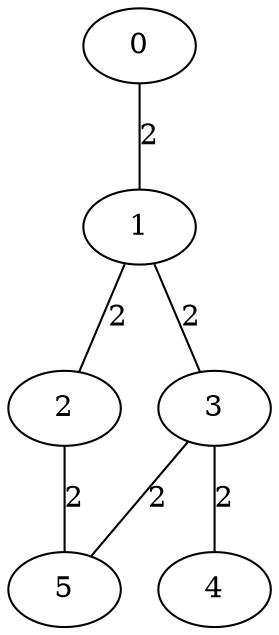

---
tags:
  - apxf/exos
---

## q 4-8

1)           -         
- $\int |f(x)| \, dx=0\implies f(x)=0?$ oui car intégrande positive sur I 

- pour $\|.\|_{1}$ 

soit $f\in \mathcal{C}(I,\mathbb{R})$, $\|f-g\|_{1}=0$ $\implies |f-g|=0$ vrai ssi $f=g$

car $f$ et $g$ sont continues

$d(f,g)=d(g,f)$?

$d_{1}(f,g)=\int _{1}^{+\infty}|f-g(x)|\;dx= \int _{1}^{+\infty}|g-f(x)| \, dx=d_{1}(g,f)$

$\int |f-g| =\int _{1}^{+\infty}|f-g+h-h \, dx\leq\int_{1}^{+\infty} |f-h+h-g|\leq \int_{1}^{+\infty} |f-h|+|h-g|=d_{1}(f,h)+d_{1}(h,g)$

Cauchy-Swartz pour $\|.\|_{2}$

$$
\|xy\|_{2}\leq \|x\|_{2}\|g\|_{2}
$$

- soit $(f,g,h)\in \mathcal{C}(I,R)^{3}$

$$
d(f,g)= \left( \int _{1}^{+\infty}|f-g|^{2}(x) \, dx \right)^{\frac{1}{2}}=0 
$$

$$
\implies|f-g|^{2}=0\implies|f-g|=0\implies f=g \text{ car }f \text{ et }g \text{ continues et positives}
$$

- $d_{2}(f,g)=\left( \int _{1}^{+\infty}|f-g|^{2}(x) \, dx \right)^{\frac{1}{2}}=\left( \int _{1}^{+\infty}|g-f|^{2}(x) \, dx \right)^{\frac{1}{2}}=d_{2}(g,f)$

$\|.\|_{\infty}$

- naturel à cause de valeur absolue
- naturel à cause de valeur absolue

- $d_{\infty}(f ,g)=sup_{x\in I}|f(x)-g(x)$

$$
\begin{align}
|f(x)-g(x)|&\leq |f(x)-h(x)|+|h(x)-g(x)| \\
&\leq sup_{x\in I}|f(x)-h(x)|+sup_{x\in I}|h(x)-g(x)|
\end{align}
$$

$\forall x\in I,|f(x)-g(x)|\leq d_{\infty}(f,h)+d_{\infty}(h,g)$
$sup_{x\in I}|f(x)-g(x)\leq d_{\infty}(f,h)+d_{\infty}(h,g)$
$d_{\infty}(f,g)\leqd_{\infty}(f,h)+d_{\infty}(h,g)$

---

$$
f_{n}(x)= \begin{cases}
1-nx \text{ si } 0\leq x\leq \frac{1}{n} \\
0 \text{ si } \frac{x\geq1}{n}
\end{cases}
$$

$$
\begin{align}
\|f_{n}\|_{1}&= \int _{1}^{\frac{1}{n}}|1-nx| \, dx   \\
&=\int_{0}^{\frac{1}{n}}1-nx  \, =\left[ x-\frac{nx^{2}}{2} \right]_{0}^{\frac{1}{n}}  \\
\|f_{n}\|_{1}&= \frac{1}{n}- \frac{n}{2}\times \frac{1}{n^{2}}=\frac{1}{2n}\xrightarrow[d_{1}]{}0
\end{align}
$$

$$
\|f_{n}\|_{\infty}=sup_{x\in I} |f_{n}(x)|=f_{n}(0)= 1 \not \xrightarrow[d_{1}]{}0
$$

## ex 1-1

1)  -

2)   -

le plus court chemin entre deux point est une ,distance si le poids est positif 
- si $d(a,c)\leq d(a,b)+d(b,c)$ vrai car plus court chemin
- si $d(a,b)=0$ alors comme tous les poids sont égaux à 2, le seul chemin égal à 0 est le chemin d’un sommet vers lui-même
- le graphe est non orienté donc $d(a,b)=d(b,a)$
3) on part d’un sommet et on vérifie pour chaque sommet par lequel on passe si la distance est inférieur à 6, si oui  le sommet est dans la boule, sinon non

## ex 1-3

1- la distance de Hamming entre deux mots est le nombre de lettre à changer d’un mot pour obtenir le second
2- la disance de Levenshtein est la même que la distance que Hamming sauf qu’on ne considère pas que des mots de même tailles il y a donc 3 opérations possible
- supprimer une lettre
- en changer une
- en ajouter une

si la distance entre deux mots est nulle, c’est qu’il n’y a pas de changements à faire donc les deux mots sont les mêmes.

## ex 2-4

$d_{1}(x,y)=\|x-y\|_{1}=$
$$
\left( \sum_{i=1}^{n} |x_{i}-y_{i}| \right)^{\frac{1}{1}}=\sum_{i=1}^{n} |x_{i}-y_{i}| 
$$
donc 
$$
d_{1}(x,y)=0\implies \forall\in [1;n], x_{i}=y_{y}
$$
- donc que $(x-y)=0_{\mathbb{R}^n}$

- $d_{1}(x,y)=d_{1}(y,x)$?

$\forall (x,y)\in \mathbb{R}^{2}, |x-y|=|y-x|$ donc 
$$
\sum_{i=1}^{n}|x_{i}-y_{i}|=\sum_{i=1}^{n}|y_{i}-x_{i}|
$$
donc vrai

- $d_{1}(x,y)\leq d_{1}(x,z)+d_{1}(z,x)$

$$
\begin{align}
\sum_{i=1}^{n}|x_{i}-z_{i}|+\sum_{i=1}^{n}|z_{i}-y_{i}|&\leq\sum_{i=1}^{n}|x_{i}-z_{i}|+ |z_{i}-y_{i}| \\
&\geq\sum_{i=1}^{n} |x_{i}-y_{i}|
\end{align}
$$
donc on a bien 
$$
\sum_{i=1}^{n}|x_{i}-y_{i}|\leq\sum_{i=1}^{n}|x_{i}-z_{i}|+\sum_{i=1}^{n}|z_{i}-y_{i}|
$$