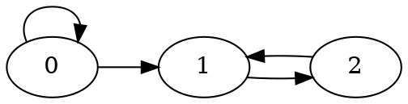

## analyse synthèse

- résoudre équation c’est prouver l’équivalence $f(x)=0\Leftrightarrow x\in S$

---
exo : résoudre $x=\sqrt{ 2-x }$

$$
\begin{align}
x&=\sqrt{ 2-x } \\
\implies x^{2}&=2-x \\
\implies x^{2}+x-2&=0  \\
\implies x&\in \{ 1;-2 \}
\end{align}
$$
si $x=1$ on a bien $1=\sqrt{ 2-1 }$
si $x=-2$ on a $-2\ne\sqrt{ 2-(-2) }$

conclusion :
donc $x=\sqrt{ 2-x }\Leftrightarrow x\in \{ 1 \}$

---
comment encoder

matrice d’adjacence : $\begin{pmatrix}1 & 1 & 0\\0 & 0 & 1\\ 0 & 1 & 0\end{pmatrix}$

$M_{3\times3}(\{ 0,1 \})$ est équipotent à $\mathcal P(\{ 0,1,2 \})$

---
soit $E$ un ensemble tq $car d(E)=n$ et $A\in \mathcal P(E)$ un sous ensemble tq $car d(A)=k$ $\mathcal P_{A}(E)$ tous les sous ensemble de E qui contiennent A :
prouver que $$\mathcal P_{A}(E)\text{ et }\mathcal P(E\setminus A)$$ 

soit $f:\begin{matrix}\mathcal P_{A}(E)\to \mathcal P(E\setminus A)\\ X\mapsto X\setminus A\end{matrix}$

soit $X\in \mathcal P_{A}(E)$
soit $x\in X\wedge x\not \in A$
donc $x\in X\setminus A$
donc $X\setminus A\in \mathcal P(E\setminus A)$

mq $f$ injective :

soit $(X_{1},X_{2})\in \mathcal P_{A}(E),f(X_{1})=f(X_{2})$

soit $x\in X_{1}$
	- si $x\in A$ comme $A\subset X_{2}$ alors $x\in X_{2}$
	- sinon $x\in X_{1}\setminus A$ donc $x\in X_{2}\setminus A$ donc $x\in X_{2}$
donc $x\in X_{2}$ donc $X_{1}\subseteq X_{2}$ par symétrie $X_{2}\subseteq X_{1}$ donc $X_{1}=X_{2}$ donc injective

mq $f$ surjective :
soit $Y\in E\setminus A$ $X\in Y\cup A$ est un antécédent de $Y$
donc $f$ surjective donc $f$ bijective donc $\mathcal P_{A}(E)$ est équipotent à $\mathcal P(E\setminus A)$

si $car d(E)=n$ $car d(A)=m$

$car d(\mathcal P(E))=2^{n}$

$car d(\mathcal P(E\setminus A))=2^{n-m}$

contre exemple :

x=1

### ex 3

$$
\begin{align}
\implies&: \text{si }A=\emptyset \\
&\subseteq \text{ soit } x\in ( A\cap B^{C})\cup(A^{C}\cap B) \\
& \text{ disjonction de cas} \\

&\supseteq \text{ soit } x\in B \\
&\text{ donc }x \in E\cap B \\
&\text{ donc} x\in(A\cap B^{C})\cup (A^{C}\cap B \\
.) 
\end{align}
$$